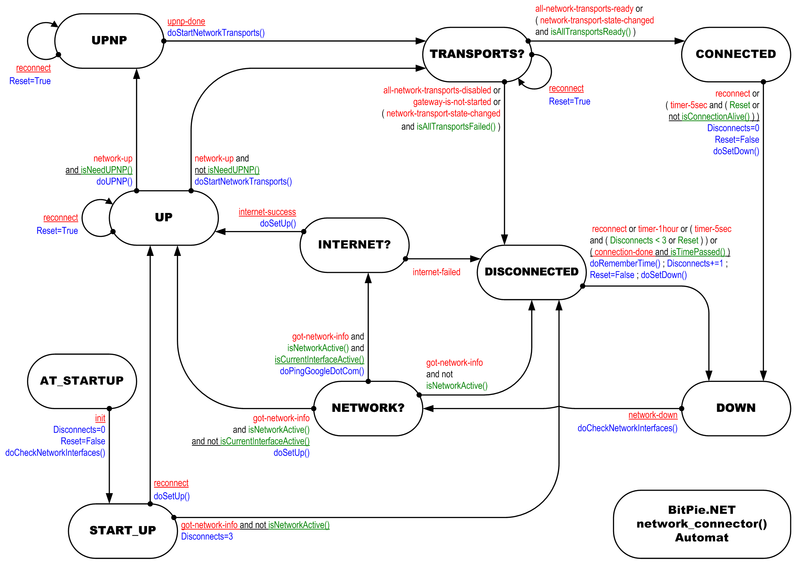

# Автомат network_connector()

## Описание

Автомат `network_connector()` нужен для контроля состояния подключения к сети Интернет и запуска процедур переподключения к сети в различных частях программного обеспечения при последующем восстановлении сетевого соединения.

В состоянии __CONNECTED__ он будет периодически проверяет наличие входящего трафика и определять текущиее состояние соединения.

Два основных метода управляют процессом переподключения:

    * doSetUp()
    * doSetDown()

Если некоторые сетевые интерфейсы активны в данный момент, но программное обеспечение по-прежнему не может соединиться с другими узлами, автомат будет пытаться провести пинг сайта http://bitpie.net и решить имеется ли какое либо подключение к сети Интернет.

## События:
    * all-network-transports-disabled
    * all-network-transports-ready
    * connection-done
    * gateway-is-not-started
    * got-network-info
    * init
    * internet-failed
    * internet-success
    * network-down
    * network-transport-state-changed
    * network-up
    * reconnect
    * timer-1hour
    * timer-5sec
    * upnp-done